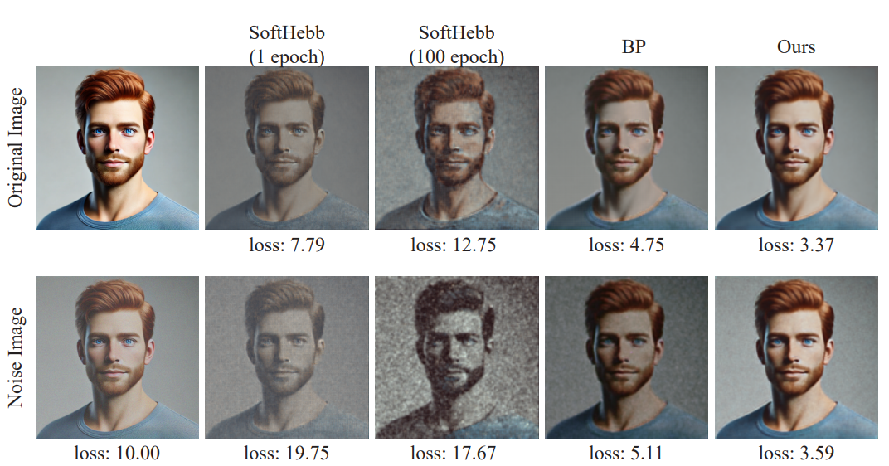

# SPHeRe

This is the official PyTorch implementation for "Rethinking Hebbian Principle: Low-Dimensional Structural Projection for Unsupervised Learning" (NeurIPS 2025)

## Unsupervised learning

```bash
# Clone our repository
git clone https://github.com/brain-intelligence-lab/SPHeRe.git
cd SPHeRe

# Install and activate base anaconda environment
conda env create -n SPHeRe --file requirements.yml
conda activate SPHeRe

# Train a NN on CIFAR10 to reproduce the SOTA result printed on the paper
python hebb.py

# Or if you want to specify parameters:
python hebb.py [-h] [--cuda CUDA] [--seed SEED] [--dataset DATASET] [--is_bp]
```

For Tiny-ImageNet dataset, torchvision does not provide an api, you can use huggingface api, but because of internet instability, we choose to download manually and load the raw data from [this repository](https://github.com/pranavphoenix/TinyImageNetLoader).

## Reconstruction experiment



To reimplement the AE for reconstruction, run:

```bash
python reconstruction/run.py --noise_mean 0.0 --noise_std 0.0
```

If you want to use your own pretrained models:

1. First run these to save the model files:

   ```bash
   python hebb.py
   python softhebb.py
   ```

2. The models will be saved in `./models/` folder

3. Then run the reconstruction code above

## Citation

If you find this work useful, please cite our paper:

```
```

